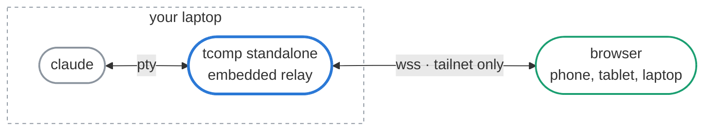
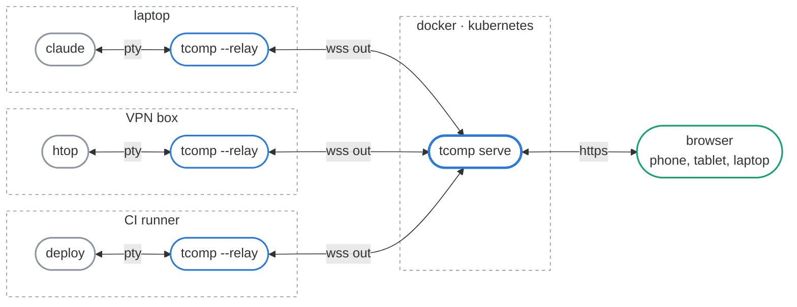

# tcomp — take your terminals on the go

Start a session on your laptop and carry on with it from anywhere. Two shapes,
one binary: the relay either rides along with the command on the machine you are
already on, or runs somewhere of its own that both the command and the browser
can reach.


## Features

**standalone** — embedded relay on a loopback port, nothing to deploy. Prints the
watch URL and runs your command.

```sh
tcomp standalone -- claude
```

**client** — use a relay someone else runs. The wrapper dials _out_, so it opens
no inbound port and works behind NAT, on a customer network, or on a VPN.

```sh
tcomp --relay https://tcomp.example.com -- claude
```

**server** — be that relay, serving the viewer and fanning out to browsers. This
is what the Docker image runs.

```sh
TCOMP_TOKEN=$(openssl rand -hex 16) tcomp serve
```

**interactive** — let the browser type into the terminal instead of just
watching. Off by default, decided by the host, and never safe on a relay you
would not hand a shell to.

```sh
tcomp standalone --allow-input -- claude
```

## Installing the client

The client is the wrapper — it runs your command under a pty and mirrors it
out, whether the relay is embedded (`standalone`) or somewhere else
(`--relay`). Releases are built for Linux only, `x86_64` and `aarch64`, linked
against musl, so there is no libc to match. Anywhere else, build it from the
flake.

### Nix

The flake exposes the binary as `packages.default` and carries `web/` along with
it, so the viewer is served wherever you run it from.

```sh
nix run github:flodurorg/tcomp -- standalone -- claude
```

On NixOS, take the flake as an input and put the package on the system:

```nix
inputs.tcomp.url = "github:flodurorg/tcomp";
inputs.tcomp.inputs.nixpkgs.follows = "nixpkgs";

environment.systemPackages = [
  inputs.tcomp.packages.${pkgs.stdenv.hostPlatform.system}.default
];
```

### Release tarball

Every tag ships both architectures with a `.sha256` beside them:

```sh
VERSION=v0.6.0
TARGET=x86_64-unknown-linux-musl # or aarch64-unknown-linux-musl
BASE=https://github.com/flodurorg/tcomp/releases/download/$VERSION

curl -fsSLO "$BASE/tcomp-$VERSION-$TARGET.tar.gz"
curl -fsSLO "$BASE/tcomp-$VERSION-$TARGET.tar.gz.sha256"
sha256sum -c "tcomp-$VERSION-$TARGET.tar.gz.sha256"
tar xzf "tcomp-$VERSION-$TARGET.tar.gz"
```

The archive holds the binary and the `web/` that `standalone`'s embedded relay
serves, so keep the two together and link to the binary rather than copying it
out — the lookup follows the symlink:

```sh
sudo mv "tcomp-$VERSION-$TARGET" /opt/tcomp
sudo ln -sf /opt/tcomp/tcomp /usr/local/bin/tcomp
```

A machine that only ever dials out to someone else's relay serves no viewer of
its own, and the binary alone is the whole wrapper:

```sh
sudo install -Dm755 "tcomp-$VERSION-$TARGET/tcomp" /usr/local/bin/tcomp
tcomp --relay https://tcomp.example.com -- claude
```

## Taking over an existing terminal

```sh
echo $$ # Shell PID of the terminal to take over; alternatively use ps.
tcomp standalone --allow-input -- reptyr -T <PID>
# Press Ctrl-L to redraw the transferred terminal.
```

## Standalone behind Tailscale

The relay is embedded in the wrapper: it starts with the command, mints a token
for that run, and dies with it. Nothing is deployed, nothing outlives the
session, and the tailnet is what makes it reachable.



Bind the tailnet address and the printed URL — token and all — works from any
device on the tailnet:

```sh
tcomp standalone --bind "$(tailscale ip -4)" -- claude
```

That is plain HTTP on a random port, at an address nobody remembers. For TLS and
a stable name, leave the relay on loopback and put `tailscale serve` in front of
it instead. Pin the port, since the default is random, and set `--public-url` so
the printed link points at the name Tailscale answers on rather than at
loopback:

```sh
tailscale serve --bg 8080
tcomp standalone \
  --bind 127.0.0.1:8080 \
  --public-url https://laptop.tailnet.ts.net \
  -- claude
```

Never `tailscale funnel` a session. Funnel publishes it to the internet, where
the token in the URL is the only thing between a stranger and your terminal.

## Installing the server

Same binary, other end: `tcomp serve`. This is where its artifacts come from;
[Running a relay](#running-a-relay) covers the shapes it runs in.

### Container image

`ghcr.io/flodurorg/tcomp` is multi-arch for `linux/amd64` and `linux/arm64`,
tagged `latest`, `0.6` and `0.6.0`. Pin the full version anywhere it matters;
`latest` moves under you. `tcomp serve` is the entrypoint, so the image is a
relay and never the wrapper.

```sh
docker run --rm -p 8080:8080 \
  -e TCOMP_TOKEN="$(openssl rand -hex 16)" \
  -e TCOMP_PUBLIC_URL=https://tcomp.example.com \
  ghcr.io/flodurorg/tcomp:0.6.0
```

Compose builds from your checkout rather than pulling this image; the Helm
chart pulls it.

### Nix or the tarball

Both carry the viewer the relay serves, but `tcomp serve` will not go looking
for it the way `standalone` does — it reads `TCOMP_WEB_DIR`, or `./web`
relative to where you started it, and answers 500 if neither is there. The nix
package sets the variable for you; from a tarball, point it at the directory
you extracted:

```sh
TCOMP_WEB_DIR=/opt/tcomp/web TCOMP_TOKEN=$(openssl rand -hex 16) tcomp serve
```

## Running a relay

One `tcomp serve` that outlives any single session, with wrappers dialling _out_
to it. The machine running the command opens no inbound port, which is what
makes this work from behind NAT, on a customer network, or anywhere you cannot
put a tailnet.



Wrappers and viewers present the same token, so set one: a relay started without
`TCOMP_TOKEN` is open to everyone who can reach it. Sessions live in the relay's
memory, which is why it runs as a single replica and why restarting it drops
every session instead of moving it.

```sh
tcomp --relay https://tcomp.example.com \
  --token-file ~/.config/tcomp/token \
  -- claude
```

### Docker compose

Compose builds the image from your checkout, publishes `8080` and mounts `web/`
read-only; set `TCOMP_PUBLIC_URL` to the address people will actually open.

```sh
TCOMP_PUBLIC_URL=https://tcomp.example.com docker compose up -d
```

### Kubernetes

The chart in `charts/tcomp-chart` is published to
`oci://ghcr.io/flodurorg/tcomp/tcomp-chart` and runs one replica, because
sessions live in memory and are not shared between pods. `image.tag` follows the
chart's `appVersion`, so a release ships a chart that pins its own image.

```sh
helm install tcomp oci://ghcr.io/flodurorg/tcomp/tcomp-chart \
  --set ingress.enabled=true \
  --set ingress.hosts[0].host=tcomp.example.com
```

A token is generated if you do not set one, and reused on upgrade. Read it with
`kubectl get secret tcomp -o jsonpath='{.data.token}' | base64 -d`, or set
`auth.token` / `auth.existingSecret` yourself.

Gateway API works instead of an Ingress, and the two are independent:

```sh
helm install tcomp oci://ghcr.io/flodurorg/tcomp/tcomp-chart \
  --set httpRoute.enabled=true \
  --set httpRoute.parentRefs[0].name=my-gateway \
  --set httpRoute.hostnames[0]=tcomp.example.com
```

`publicUrl` is derived from the first ingress host or `httpRoute` hostname when
left empty; set it explicitly when a proxy sits in front. Some Gateway
implementations apply a default request timeout that would cut the websocket;
set `httpRoute.timeouts.request=0s` if viewers drop.

## Security

**Unencrypted sessions are only as private as the relay and its token.** Anyone
holding the token sees everything the command prints — file contents, tokens,
keys — and on an `--allow-input` session can type into your terminal as you.

`tcomp standalone` mints a fresh token per run and carries it in the printed
watch URL, so an embedded relay is never open — not even when you `--bind` it to
a tailnet address. `tcomp serve` is **open until you set `TCOMP_TOKEN`**; set
one, or keep the relay somewhere private or behind an authenticating proxy. It
says so in the log on every start.

Opening a `?token=…` link moves the token into an `HttpOnly`, `SameSite=Lax`
cookie and redirects to the clean URL, so the secret leaves the address bar and
never rides along in a `Referer`. Without a link you get a sign-in page instead.
Scripts can send `Authorization: Bearer <token>`. Tokens must be URL-safe —
letters, digits and `-._~` — and the relay refuses to start otherwise.
`/healthz` and `/static` stay open.

Pass `--token-file` instead of `--token` to keep the secret out of your shell
history, out of `ps`, and out of the environment every child process inherits —
point it at a mounted Kubernetes secret, a `systemd` credential, or a `chmod 600`
file. It is read once at startup and trimmed of the trailing newline `echo`
leaves behind. Naming both a token and a token file is refused rather than
silently preferring one, and a token file that cannot be read is fatal, so a
typo in the path can never start a relay that is wide open.

`src/server/auth.rs` is still the single seam, and what it
implements is one shared token: access is all-or-nothing, with no per-session
scope and no separate read-only credential.

### End-to-end encryption

Encryption is opt-in and works alongside ordinary sessions on the same relay:

```sh
tcomp --encrypt --relay https://tcomp.example.com --token-file ~/.config/tcomp/token -- bash
tcomp standalone --encrypt --allow-input -- bash
```

`--encrypt` (or `TCOMP_ENCRYPT=true`) generates a fresh 256-bit key for that
session. The printed watch link ends in `#key=…`; share the **complete link**.
The browser handles the fragment locally: the key is never included in HTTP
requests, cookies, relay logs or WebSocket messages. The relay token is still
required independently. Losing the link loses access to the encrypted session;
there is no server-side key recovery. Restarting the wrapper creates a new key.

Terminal output, input, names, commands, titles and working directories are
encrypted with AES-256-GCM, with HKDF-SHA-256 separating stream and writer keys.
The host authenticates input and rejects duplicates and input from previous
producer connections. Encryption never falls back to plaintext if the relay or
browser does not support it. Upgrade the relay and its `web/` assets together.

The dashboard shows generic encrypted cards without previews. Opening a keyed
link unlocks its session; the browser remembers keys in session storage for
reloads and same-tab dashboard navigation, not in persistent local storage.
On another device or in a new browser session, open the complete link again.
Anyone with the key and relay access can read that session and, if the host
used `--allow-input`, type into it. There is no separate read-only key.

Browser encryption needs **HTTPS or localhost**. A plain-HTTP tailnet IP is not
a secure browser context: use `tailscale serve` with `--public-url` as above.
Continue using HTTPS/WSS even with encryption to protect authentication and the
viewer code. Protect watch links like passwords, including browser history,
clipboard contents and any place you paste them.

The relay stores encrypted snapshots and deltas, bounded by
`TCOMP_HISTORY_BYTES`. The producer, rather than the relay, maintains the terminal
screen and 2,000 lines of scrollback. Late joins and reconnects restore a snapshot;
a snapshot too large for the relay's budget stops encrypted sharing with an
explicit warning rather than sending plaintext or incomplete history. The local
command keeps running. Increase the relay's history budget for larger screens.

Encryption hides content from relay storage and transport inspection, **not from
malicious viewer JavaScript**: the relay serves the browser application, so a
compromised relay can serve code that steals the key. Use a trusted viewer origin.
Session IDs, lifecycle, input permission, connection addresses, handshake terminal
dimensions, traffic sizes and timing remain visible. A relay can withhold data or
replay old history to a newly opened viewer; content encryption does not prove
freshness. This does not provide forward secrecy or protect compromised endpoints
or against someone who has the session key.

## Parameters

Session flags, each with an environment equivalent:

| Flag            | Env                 | Meaning                                                    |
| --------------- | ------------------- | ---------------------------------------------------------- |
| `--relay`       | `TCOMP_RELAY`       | relay base URL; required unless `standalone`               |
| `--name`        | `TCOMP_NAME`        | label in the web UI (default: hostname)                    |
| `--allow-input` | `TCOMP_ALLOW_INPUT` | let the browser type into this terminal                    |
| `--encrypt`     | `TCOMP_ENCRYPT`     | encrypt this session end to end (off by default)           |
| `--exit-on-end` | `TCOMP_EXIT_ON_END` | exit when the command exits, instead of offering a restart |
| `--token`       | `TCOMP_TOKEN`       | token to present to the relay                              |
| `--token-file`  | `TCOMP_TOKEN_FILE`  | file to read that token from instead                       |

Relay parameters, which configure whichever relay is running — the one embedded
in `standalone` or a separate `tcomp serve`. `standalone` takes the first two as
flags as well:

| Flag           | Env                      | Default                                        | Meaning                                                               |
| -------------- | ------------------------ | ---------------------------------------------- | --------------------------------------------------------------------- |
| `--bind`       | `TCOMP_BIND`             | `127.0.0.1:0` embedded, `0.0.0.0:8080` serving | listen address; a bare IP takes a random port                         |
| `--public-url` | `TCOMP_PUBLIC_URL`       | the bound address                              | base URL session links are built from                                 |
|                | `TCOMP_TOKEN`            | none for `serve`, minted for `standalone`      | token the relay requires; unset leaves `serve` open                   |
|                | `TCOMP_TOKEN_FILE`       | none                                           | file holding that token; a relay that cannot read it refuses to start |
|                | `TCOMP_WEB_DIR`          | `web`                                          | directory holding the viewer pages                                    |
|                | `TCOMP_ENDED_TTL`        | `60`                                           | seconds a cleanly-exited session is kept                              |
|                | `TCOMP_STALE_TTL`        | `14400`                                        | seconds a disconnected session is kept                                |
|                | `TCOMP_PRODUCER_TIMEOUT` | `60`                                           | seconds a producer may go silent before it counts as gone             |
|                | `TCOMP_SCROLLBACK`       | `2000`                                         | scrollback lines kept server-side                                     |
|                | `TCOMP_HISTORY_BYTES`    | `524288`                                       | replay buffer per session                                             |

## Sessions

Every producer shows up as a floating window on the relay's dashboard — click
one to open it, type on the laptop or in the browser, and it's mirrored to
the other.

| In the UI    | Status  | When                                             | Kept for          |
| ------------ | ------- | ------------------------------------------------ | ----------------- |
| live         | `live`  | producer connected                               | while connected   |
| interactive  | `live`  | producer connected, started with `--allow-input` | while connected   |
| finished     | `ended` | the command exited and the relay was told        | `TCOMP_ENDED_TTL` |
| disconnected | `stale` | the producer vanished without saying goodbye     | `TCOMP_STALE_TTL` |

The relay pings every producer and marks the session disconnected once one has
answered nothing for `TCOMP_PRODUCER_TIMEOUT`, so a host that dies without
closing its connection — a suspended laptop, a killed container — stops being
advertised as live.

A disconnected session is greyed out and history only, and goes live again by
itself if the client reconnects. Input is refused whenever a session is not live.
The child's exit code is the wrapper's, and status lines go to stderr, never into
the stream the browser sees.

## Development

```sh
nix develop
cargo test
cargo clippy --all-targets -- -D warnings
cargo run -p tcomp -- standalone -- htop
```

`web/` is read from disk per request, so viewer changes need no rebuild.
`docs/record-demo.sh` regenerates the GIF above. `cargo test --test
floating_windows -- --ignored` covers the same flow (2-3 sessions, select
one, type on both sides) as a browser-driven integration test.
