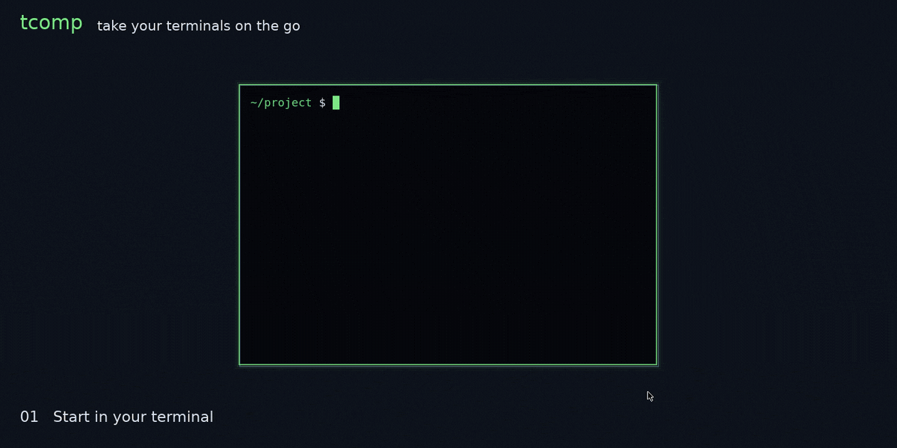

# tcomp — take your terminals on the go

Run a command locally; watch it from a browser. Read-only by default, two-way
with `--allow-input`.



The command runs exactly as it would in your terminal. The browser renders it at
the host's exact dimensions — never reflowed — and works on a phone.

## Features

**standalone** — embedded relay on a loopback port, nothing to deploy. Prints the
watch URL and runs your command.

```sh
tcomp standalone -- claude
```

**client** — use a relay someone else runs. The wrapper dials *out*, so it opens
no inbound port and works behind NAT, on a customer network, or on a VPN.

```sh
tcomp --relay https://tcomp.example.com -- claude
```

**server** — be that relay, serving the viewer and fanning out to browsers. This
is what the Docker image runs.

```sh
tcomp serve
```

**interactive** — let the browser type into the terminal instead of just
watching. Off by default, decided by the host, and never safe on a relay you
would not hand a shell to.

```sh
tcomp standalone --allow-input -- claude
```

## Security

**There is no authentication.** Anyone who can reach the relay sees everything
the command prints — file contents, tokens, keys. `--allow-input` raises that to
**arbitrary code execution**: they can type into your terminal as you.

Run the relay somewhere private or behind an authenticating proxy.
`crates/tcomp/src/server/auth.rs` is the single seam for adding auth.

## Deploying

**tailnet** — `--bind` the tailnet address and the printed URL works from any
device on the tailnet. For TLS and a stable `<machine>.<tailnet>.ts.net` name,
leave the relay on loopback and put `tailscale serve --bg <port>` in front of it
instead. Never `tailscale funnel` it.

```sh
tcomp standalone --bind "$(tailscale ip -4)" -- claude
```

**docker compose** — the image runs `tcomp serve`. Compose publishes `8080` and
mounts `web/` read-only; set `TCOMP_PUBLIC_URL` to the address people will
actually open.

```sh
TCOMP_PUBLIC_URL=https://tcomp.example.com docker compose up -d
```

## Parameters

Session flags, each with an environment equivalent:

| Flag | Env | Meaning |
| --- | --- | --- |
| `--relay` | `TCOMP_RELAY` | relay base URL; required unless `standalone` |
| `--name` | `TCOMP_NAME` | label in the web UI (default: hostname) |
| `--allow-input` | `TCOMP_ALLOW_INPUT` | let the browser type into this terminal |

Relay parameters, which configure whichever relay is running — the one embedded
in `standalone` or a separate `tcomp serve`. `standalone` takes the first two as
flags as well:

| Flag | Env | Default | Meaning |
| --- | --- | --- | --- |
| `--bind` | `TCOMP_BIND` | `127.0.0.1:0` embedded, `0.0.0.0:8080` serving | listen address; a bare IP takes a random port |
| `--public-url` | `TCOMP_PUBLIC_URL` | the bound address | base URL session links are built from |
| | `TCOMP_WEB_DIR` | `web` | directory holding the viewer pages |
| | `TCOMP_ENDED_TTL` | `60` | seconds a cleanly-exited session is kept |
| | `TCOMP_STALE_TTL` | `14400` | seconds a disconnected session is kept |
| | `TCOMP_SCROLLBACK` | `2000` | scrollback lines kept server-side |
| | `TCOMP_HISTORY_BYTES` | `524288` | replay buffer per session |

## Sessions

A session is live while the producer is connected, `finished` once the command
exits, and `disconnected` if the producer vanishes — greyed out, history only,
and live again by itself if the client reconnects. The child's exit code is the
wrapper's, and status lines go to stderr, never into the stream the browser sees.

## Development

Rust is not on `PATH` outside the Nix shell.

```sh
nix develop
cargo test
cargo clippy --all-targets -- -D warnings
cargo run -p tcomp -- standalone -- htop
```

`web/` is read from disk per request, so viewer changes need no rebuild.
`docs/record-demo.sh` regenerates the GIF above.
